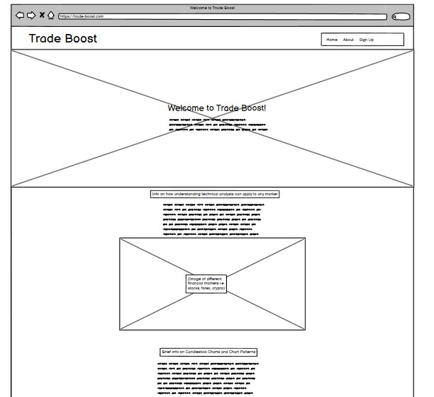
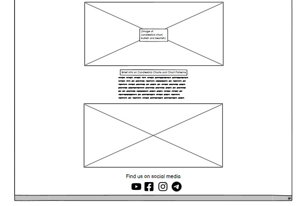
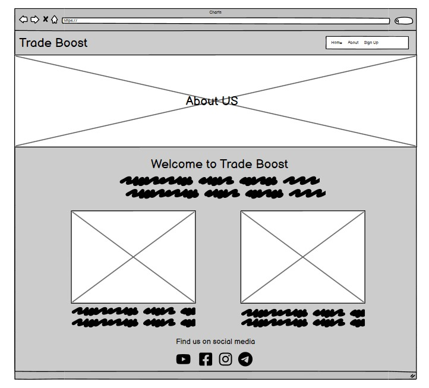
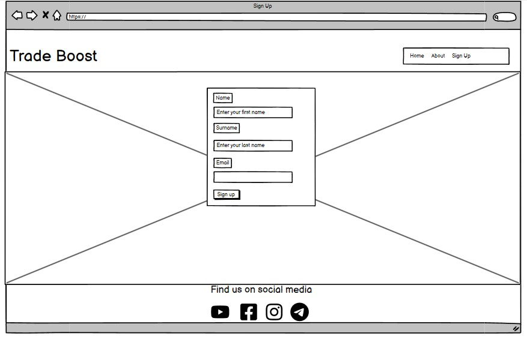
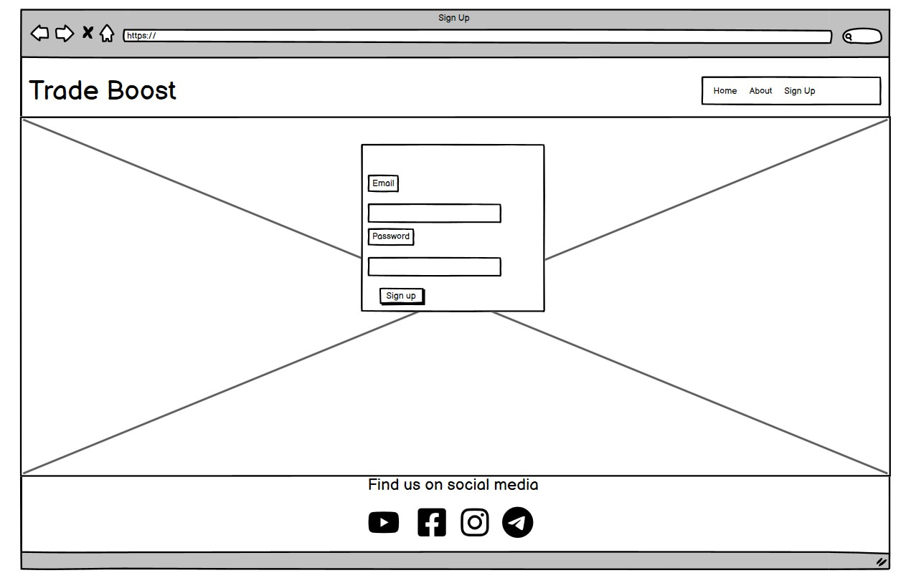
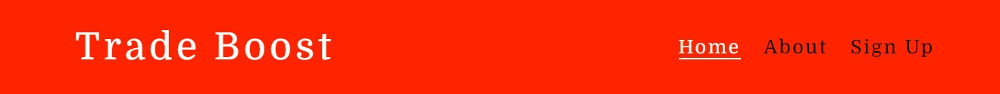
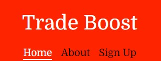
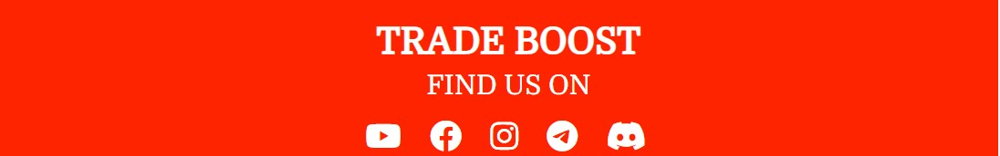

# Trade Boost

The goal of Trade Boost is to teach about trading in the financial markets. It aims to teach beginners or any viewer how to better understand and use Technical Analysis (TA) to their advantage when making trades or analysing the market. This can be applied in any market, for example: Stocks, Forex, Crypto or Commodities.

# UX (User Experience)

### Business Goals
 - Provide value by creating a platform in which users and viewers can visit and learn how to trade.
 - Increase web traffic, garner attention and thus generate more members in Trade Boost.
 - Provide an easily navigatable interactive experience to any and all users of the website.
 - Provide an easy, sign up process with no payments necessary from the start. Value-first approach.
 - Increase awareness and teach anyone about the difference between investing or trading and that anyone can do it.

 ### User Goals
- To gain a better understanding about technical analyis and explore different styles of trading.
- To use the website as a point of reference about charts or information they may need about trading.
- To explore what values and benefits that Trade Boost provides before signing up.

### Potential Customers
- This is targeted to anyone that is interested in the financial markets, researching or beginners looking to make a start and learn to trade.
- Experienced or non experienced traders.
- People that are interested in making another form of income.

### User Stories

1. As a new user, I would like an immediate impression that will let me know about the purpose of the website.
2. I would like to easily navigate around the pages and read information clearly.
3. I would like to easily know where I can sign up if I like the content of the web site and want to gain access to more content.
4. As a new user, I expect to find out more information about the origins and creators of the website.
5. As a returning user, I want to know what social media platforms they are on so that I can follow them if I am interested in their content.
6. As a potential member, I want to know how I can become a member.
7. As a potential member, I want to be able to have the freedom that if I join, I am able to leave and not have to pay anything in the beginning.
8. As a member, I want to be able to visit the website and have the ability to log in, instead of signing up.

## Wireframes

I used [Balsamiq](https://balsamiq.com/wireframes/) to create the wireframes of the website and this was used as a guideline towards building the finished project. Attached below are the wireframes that were used as a guideline for this project.

### Main Page

### About Page

### Sign up & Login Page

# Features

## Common Features

There are **3 common structures** which is presented throughout the whole website.

**The first is the Navigation Bar** which is at the top of the page, this has the option to click and take the user to other pages of the website. 

Only the Nav bar changes color when you are on a certain page. 

For example: if you are in the home page, the **Home** section changes to a different color. This allows the user to have an idea and know that they are in the home page.

#### Navigation Bar for Big screen sizes 950px and above

#### Navigation Bar for Smaller screen sizes 950px and below

**The second is the Footer Section**, this is the second common structure and it contains the website name as well as social media links that users can click and go to.

#### Footer Section

### Hero Image Section

**This is the third common structure**. Each page has the same hero image that is displayed underneath of the navigation bar. 

There will be text written inside of each hero image, for example:
- On the Home page, there will be text saying "Welcome to Trade Boost" centered with additional text underneath.
- On the About Page, there will be text saying "About Us"
- On the Sign Up and Login pages, the hero image will be in the background.

Users can click the "Trade Boost" logo that is located at the top of the page where the navigation section is and it can also take them to the home page. 

### Home Page

This is the landing page of the website. It will be the first page that the user sees upon clicking the link to Trade Boost. 
Aside from the common features of each page of the website which is mentioned above, this page consists of the following:
- Brief information on what Technical Analysis (TA) is and what it is used for.
- Brief information on Candlestick charts, followed by video below in which the user can either click to go to the linked website or to watch on the current website.
- Brief information on different trading styles.
- At bottom of the page, just above the footer section, the is a section that can direct a user to learn chart patterns. The user can access this but clicking the button that says "Click here".

### About Page

This is the second page. The aim of the page is to inform the users of the purpose of the website and a brief background of the creators of Trade Boost. Excluding the mentioned common features of each page, the about page consists of the following:
- A brief information on the purpose of Trade Boost
- Brief information of the founders of Tradeboost
- An image of each founders and more information about them.

### Sign up and Login Page
These pages are self explanatory. Aside from the common features of each page. The Sign up page consists of:
- A form to enter necessary user details for signing up.
- A "Join" button that the user can click if they want to sign up.
- If the user already has an account, there is a login button in which they can click to go to the login page. The login page consists of a form in which they must enter their email and password to gain access.

# Technologies Used
The following list are the types of technologies used in building this website:
- **[HTML5](https://en.wikipedia.org/wiki/HTML5)** (HyperText Markup Language) was used in creating the core content of the website.
- **[CSS3](https://en.wikipedia.org/wiki/CSS)** (Cascading Style Sheet) was used in styling the website.
- **[Balsamiq](https://balsamiq.com/wireframes/)** was used in designing the wireframes of the website prior to the creation of each page.
- **[Google Fonts](https://fonts.google.com/)** was used to link and source different types of fonts for the website.
- **[Font Awesome](https://fontawesome.com/)** was used to link and source different icons for the footer section.
- **[Pexels](https://www.pexels.com/)** was used to source free copyright images which were used for the website.
- **[TinyPNG](https://tinypng.com/)** was used to compress any image that was used for the website.

